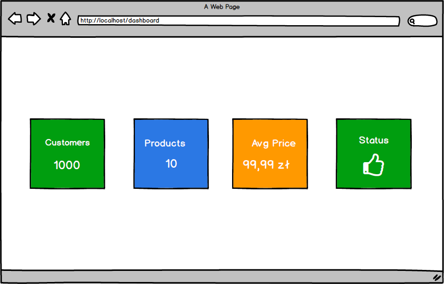

# Ćwiczenie: Tworzenie własnych komponentów na przykładzie Dashboard

## Cel:
Twoim zadaniem jest stworzenie prostego komponentu Blazora, który może być wielokrotnie używany na stronie typu dashboard. Komponent powinien wyświetlać określone informacje na temat produktu, użytkownika lub innego zasobu – w zależności od przekazanych parametrów.

## Szkic: 
  

---

## Wymagania funkcjonalne:
1. **Komponent:**
- Stwórz własny komponent (np. `InfoCard.razor`)
- Komponent powinien przyjmować następujące parametry:
  - Tytuł (string)
  - Wartość (string lub liczba)
  - KolorTła (opcjonalnie – string z klasą CSS)
  - (Opcjonalnie) Ikona – np. w formie emoji lub nazwy ikony
- Komponent powinien wyświetlać przekazane dane w estetycznym "boxie" (np. z cieniem, zaokrąglonymi rogami itp.)

2. **Dashboard:**
- Na stronie `Dashboard.razor` osadź ten komponent minimum 4 razy, każdy z innymi danymi
- Przykładowe zastosowania komponentu:
	- Liczba klientów
	- Liczba produktów
	- Średnia cena produktu
	- Status systemu

3. **Wygląd:**
- Komponent powinien być gotowy do wielokrotnego użytku w układzie siatki (grid/flex)
- Stylizacja może być wykonana za pomocą CSS lub Bootstrap

👉 Wskazówka: Możesz użyć [`https://flexboxlabs.netlify.app`](https://flexboxlabs.netlify.app/) do zaprojektowania układu strony.
